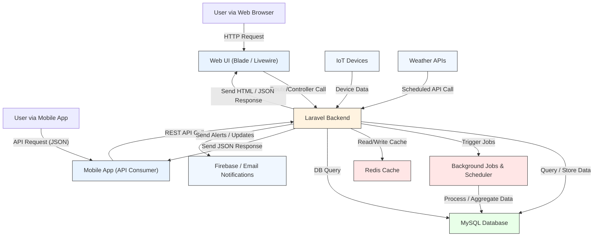

# Smart Coir Technical Architecture Documentation

## Executive Summary

Smart Coir is a modern web application designed to streamline coir production management. The system combines traditional web interfaces with real-time IoT device monitoring to provide comprehensive production tracking and insights.

### Key Features
- Real-time production monitoring
- IoT device integration
- Automated reporting and analytics
- Mobile app support
- Multi-user collaboration

## System Overview

Smart Coir is built with Laravel, utilizing:
- Modern web technologies for responsive user interfaces
- Real-time data processing for IoT device integration
- Secure API endpoints for mobile access
- Background processing for automated tasks

## Core Architecture Components

The system is organized into interconnected modules that handle different aspects of coir production management:

### Contract (inputs / outputs)
- Inputs: HTTP requests (web routes and API endpoints), authenticated user, team context
- Outputs: HTML (Blade + Livewire), JSON (API), emails and scheduled jobs
- Error modes: auth/authorization failures, validation errors, third-party API or cron failures

### Key components
- Routes: `routes/web.php`, `routes/api.php` — define public and authenticated endpoints
- Controllers: `app/Http/Controllers/...` — request handling and orchestration
- Livewire components: `app/Http/Livewire` and used directly from routes (single-action components)
- Models: `app/Models` — Eloquent models representing domain objects and device data
- Views: `resources/views/...` — Blade templates and Livewire partials

## Detailed Architectural Diagram

## Data Processing and Integration

### Data Processing Pipeline


### System Integration Points
- **IoT Device Integration**: Real-time data collection via MQTT/HTTP protocols
- **Mobile App Integration**: RESTful API endpoints with JWT authentication
- **External Services**: Weather data integration, Firebase notifications
- **Background Processing**: Laravel jobs and scheduled tasks
- **Caching Strategy**: Cloudflare

## Technical Reference

### Directory Structure
```
app/
├── Http/
│   ├── Controllers/    # Request handlers
│   └── Livewire/       # Real-time UI components
├── Models/             # Database models
├── Services/           # Business logic
└── Jobs/               # Background tasks

resources/
└── views/             # UI templates

routes/
├── web.php            # Web routes
└── api.php            # API endpoints
```

### Key Technologies
- **Backend**: PHP Laravel (Controllers, Livewire, Scheduler, Jobs)
- **Frontend**: Blade + Livewire
- **Database**: MySQL
- **Messaging**: Firebase Cloud Messaging, Email Notifications
- **Integrations**: Weather APIs (tomorrow.io), IoT devices
- **Deployment**: AWS (EC2), Laravel Scheduler

### Development Guidelines
1. Follow Laravel best practices
2. Use type hints and docblocks
3. Write unit tests for critical paths
4. Follow PSR-12 coding standards
5. Document API endpoints

---

Last updated: 2025-09-26


