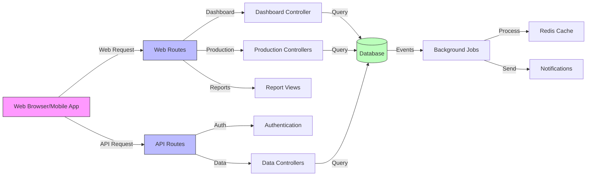
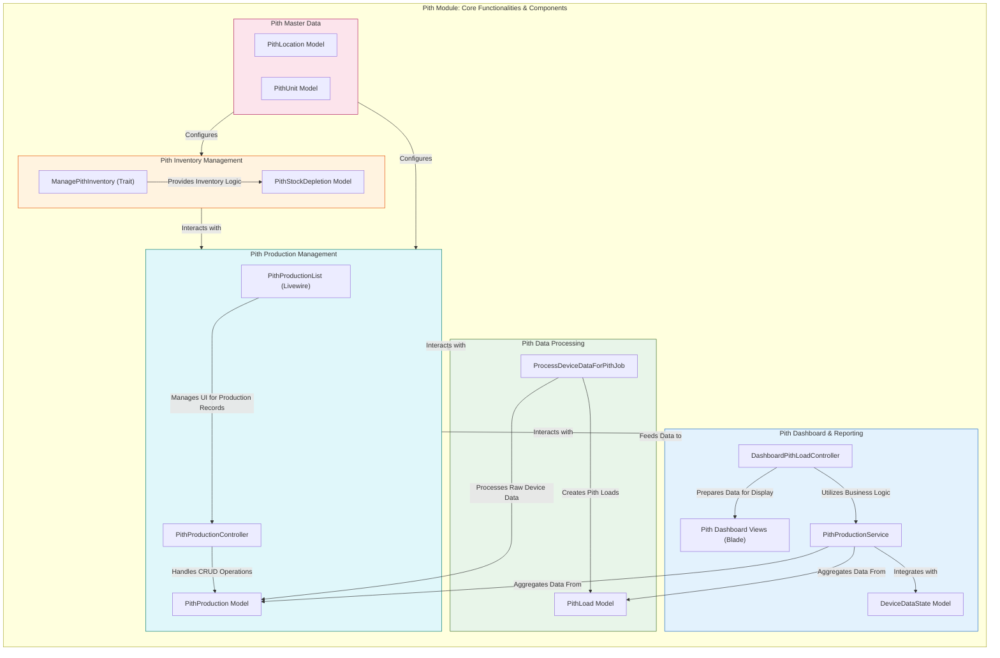
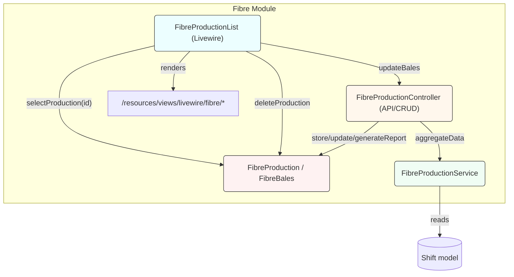
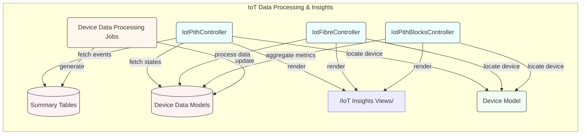
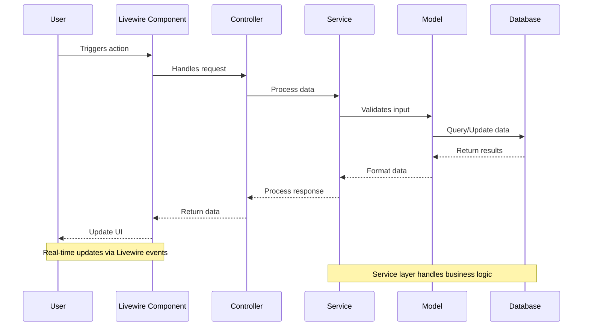

# Technical Workflow Documentation

## System Components and Request Flow

### Frontend Components
- UI routes utilize Livewire single-action components for reactive interfaces
- Components are defined in `routes/web.php` using `ClassName::class` syntax
- Blade views and Livewire partials are organized under `resources/views/`

### API Layer
- RESTful JSON endpoints implemented in `app/Http/Controllers/Api/*`
- Handles authentication, data operations, and device telemetry
- Supports mobile app integration and third-party services

### System Workflow

The following diagram illustrates how user requests flow through the system, from web browsers and mobile apps to the backend services and databases.

### Module-Specific Workflows

#### Pith Module

Notes: The Pith UI uses Livewire components (under `app/Livewire/Pith/*`) for interactive lists and modals. The components call models and use a `ManagePithInventory` trait for reusable inventory operations.

#### Fibre Module

Notes: Fibre-related Livewire components paginate/filter fibre production records and call `summary_fibre_mini_bales` backed model classes. The Dashboard Fibre controller uses `FibreProductionService` to aggregate data for charts.

### IoT Module Architecture

The IoT module handles real-time device data processing and insights generation for both Pith and Fibre production units.

Notes: IoT controllers read from device-specific tables and transform raw events into calendar-friendly JSON (events + totals) returned to the front-end. They also consult `Device` to locate the active device_id for the current team.

## Livewire Integration

Livewire components are used extensively throughout the application for real-time, reactive user interfaces. Here's how Livewire fits into the system:

1. **Component Location**: All Livewire components are stored in `app/Livewire/` directory, organized by module (Pith, Fibre, etc.)
2. **Route Integration**: Components are registered in `routes/web.php` using the `ClassName::class` syntax
3. **View Rendering**: Each component has an associated Blade view in `resources/views/livewire/`
4. **State Management**: Components maintain their state between requests, handling user interactions without full page reloads
5. **Model Interaction**: Components directly interact with Eloquent models for data operations

## Typical Request Flow

Here's a sequence diagram showing a typical user action flow:

This flow demonstrates how:
1. User interactions are captured by Livewire components
2. Data validation and processing occur in the backend
3. Real-time updates are pushed to the UI
4. The system maintains consistency across all layers
